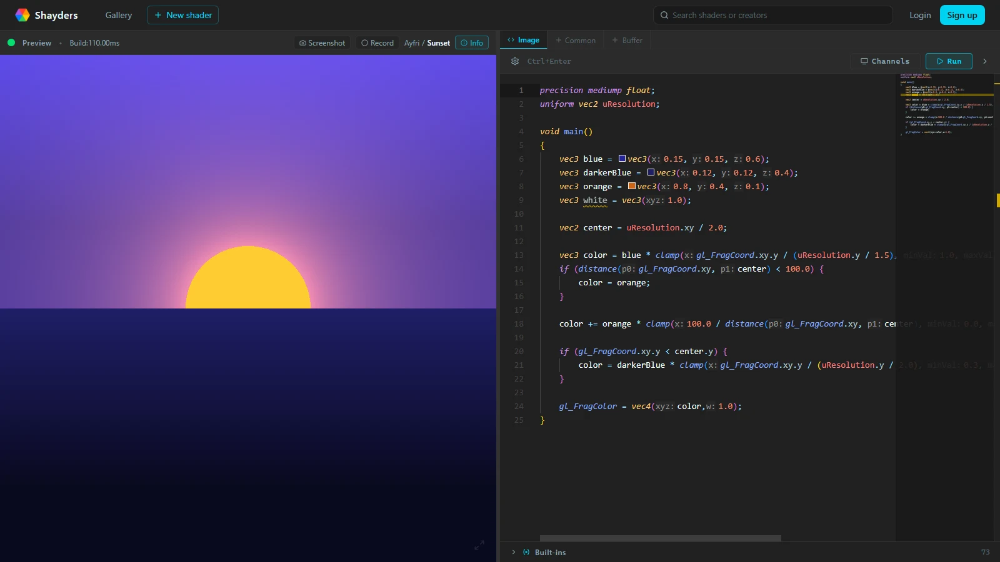
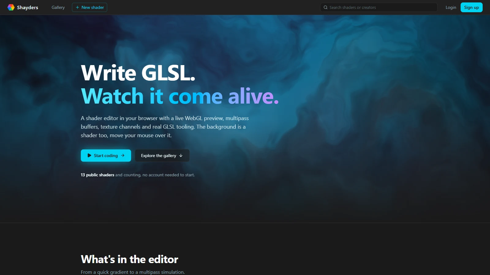

# Shayders

A modern, web-based GLSL shader editor for creating and experimenting with fragment shaders in real-time. Built with SvelteKit, featuring multipass rendering, texture channels, and community shader sharing.

Check out the live demo: [shayders.ayfri.com](https://shayders.ayfri.com)





## Features

### 🎨 Shader Editing
- **Real-time GLSL editing** with Monaco Editor (same as VS Code)
- **GLSL tooling** - syntax highlighting, autocompletion, hover docs, inline errors and color pickers
- **Multipass rendering** - up to 8 offscreen buffers (`uBufferA` to `uBufferH`) plus a shared `Common` tab
- **Live preview** with WebGL canvas, screenshots and video recording

### 🎯 Built-in Uniforms
Access these uniforms in your shaders:
- `uAspect` (float) - Canvas aspect ratio
- `uDate` (vec4) - Current date (year, month, day, timeOfDay)
- `uDeltaTime` (float) - Time since last frame
- `uFrameCount` (int) - Total frames rendered
- `uFrameRate` (float) - Current FPS
- `uMouse` (vec3) - Mouse position (x, y) and button state
- `uResolution` (vec2) - Canvas resolution
- `uTime` (float) - Current time in seconds
- `uBufferA` to `uBufferH` (sampler2D) - Output of each offscreen buffer

### 🖼️ Texture Channels
- **4 texture channels** (`uChannel0` to `uChannel3`) for images, videos, webcam or another buffer
- Uploads to Cloudflare R2 for authenticated users, with worker-based image optimization and client-side validation
- Support for PNG, JPG, GIF, WebP, AVIF, MP4, and WebM files
- Automatic texture binding and sampling

### 🌐 Community Features
- **Shader sharing** - Publish, fork and discover community shaders
- **Search** - Find shaders and creators
- **User profiles** - View shaders by author
- **Live previews** on shader cards
- **Authentication** with email verification

### 📱 Installable App
- **PWA** - Install Shayders from the browser, with shortcuts to a new shader and to search
- **Offline editor** - The home page and `/new` open offline once visited, app files are cached by a service worker

### 🚀 Performance
- **WebGL optimized** rendering
- **Thumbnail generation** for quick previews
- **Efficient multi-pass** rendering pipeline
- **Cloudflare Workers** deployment with edge-cached assets

## Technologies Used

- Built with [SvelteKit](https://svelte.dev/docs/kit/introduction) and [Svelte 5](https://svelte.dev/blog/svelte-5)
- Uses [Monaco Editor](https://microsoft.github.io/monaco-editor/) for code editing
- [PocketBase](https://pocketbase.io/) for database/backend services
- [Tailwind CSS](https://tailwindcss.com/) for styling
- [Lucide](https://lucide.dev/) for icons
- Inspired by Shadertoy

### Key Components

- **ShaderCanvas**: Handles WebGL rendering, uniform binding, and multi-buffer pipeline
- **GlslEditor**: Monaco-based editor with GLSL language support
- **ChannelsPanel**: Texture channel management
- **BuiltinsPanel**: Uniform documentation and controls
- **ShaderPreview**: Live thumbnail generation for shader cards

## Development

```sh
bun install
bun run dev
```

- `bun run check` type-checks the app, the service worker in `src/service-worker` has its own `tsconfig.json`
- `bun run og-image` regenerates `static/og-image.png`
- The service worker only runs on production builds (`bun run build` then `bun run preview`)

### Environment Setup

- `PUBLIC_POCKETBASE_URL` - Your PocketBase instance URL, declared in `src/env.ts`

Shader assets live in the R2 bucket bound as `ASSETS_STORAGE` in `wrangler.toml`. Uploads go through `/api/upload-url` and files are served from the same origin by `/api/assets/*`, so the bucket needs neither public access nor CORS rules.

### R2 Asset Limits

The editor enforces these defaults for authenticated uploads:

- Images: `2 MB` max, `2048x2048` max, optimized/compressed in a worker before upload
- Videos: `10 MB` max, `1920x1080` max, `30 seconds` max
- Per-user storage quota: `50 MB`

## License

This project is licensed under the GNU General Public License v3.0 - see the [LICENSE](LICENSE) file for details.
